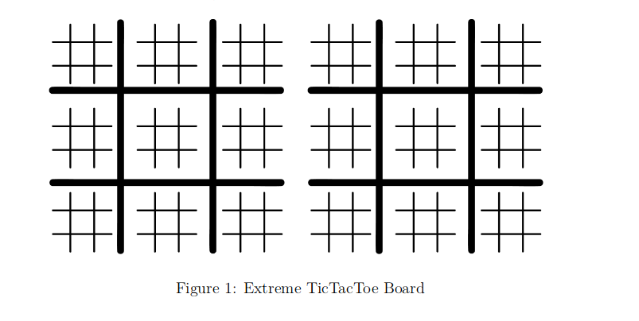
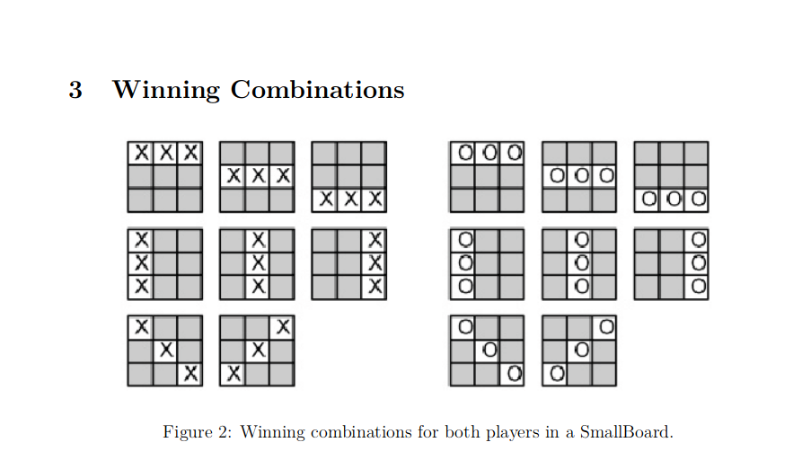

# Xtreme-TicTacToe

### Prerequisites
       Python 2.7
       
### Introduction
       * The Extreme TicTacToe is an extension of 3x3 Ultimate TicTacToe which in turn is an extension of
         standard 3x3 TicTacToe. Extreme TicTacToe comprises of 2 boards of 3x3 board in which each cell
         further is a 3x3 board.

   
  
       * The board structure is as shown above. We will refer to the whole board as BigBoardand each small board
           as SmallBoard from now on.Hence, each cell of BigBoard is aSmallBoard and SmallBoard itself has 9 cells.

       * As we have 2 boards we will call BigBoard1 and BigBoard2 respectively. And theirsmall boards will be called
           SmallBoard1 and SmallBoard2 respectively

  
  ## Rules
   * **FIRST MOVE**:The first player takes the first move and it is a free move. The player is free to move anywhere i.e.
               in any cell of any SmallBoard1 or SmallBoard2.
               
   * **CORRESPONDENCE RULE**: When a player places his marker in any of the cell, the next player can only place marker in 
               a SmallBoard1 or SmallBoard2 corresponding to that cell. For Example: If a player places his marker in Top     RightCorner cell of a SmallBoard1 then the next player can only place his marker in available cells of the Top Right Corner SmallBoard1 or Top Right Corner SmallBoard2.
               
   * **ABANDON RULE**:Once a SmallBoard is won by some player, that SmallBoard isabandoned and it has to be considered full, i.e. no more markers can be placed in thatSmallBoard.
               
   * **OPEN MOVE**:In case all the cells of both the destined SmallBoards from “Cor-respondence Rule” are occupied or if both the destined SmallBoards are abandonedaccording to “Abandon Rule”, then the move is considered to be an open move, i.e.the player can move anywhere, on any available cell of any of the SmallBoards, giventhat SmallBoard is not abandoned.
   
   * **BONUS MOVE**:If a player places his marker in a cell of a SmallBoard and thisleads to the player winning that          SmallBoard, then the he/she gets a bonus move, i.e.,he/she gets to move again. This bonus move is limited to 2 SmallBoard wins, i.e., Ifyou win another SmallBoard by placing the marker again in your bonus move, youdon’t get another bonus move.
   
   *  **WIN RULE**:The player who places their markers on 3 cells of a SmallBoard suchthat they form a vertical or horizontal line or 3 cells such that they form a diagonalwins that SmallBoard. Similarly, player who wins 3 SmallBoards such that theyform a vertical or horizontal line or win 3 SmallBoards such that they form a diagonalwins the whole game. The first player to make the winning pattern on any one ofthe BigBoards wins the game.
        
   
   
   
   ### How to run
       Just  import your class from your code and call its move function in Simulator.
       
   ### Time Limit
        You need to return a valid move from your move function within 24 seconds. Ifthe time limit exceeds 24 seconds for a particular move,
        then the match will beforfeited and the opponent wins the whole match by default
        
   ### Scoring
        * Winning a game, by forming a pattern as described in WIN RULE will give you 86 pointsand the opponent0 points.
        * If the player makes an invalid move, or exceeds time limit, or makes an illegal changeon the board, or uses 
         threading or makes any system call, then the opponent earns86 pointsand the player earns 0 points.
        * If no player has a pattern at the end of the game, both the players get points accordingto the SmallBoards they 
          have won respectively.Each small board has differentscoresas mentioned in section below.
          Smallboards which are drawn do not count aspoints for either player.
   ### Scoring of Small Boards
         *Corners: 4 points
         *Center:  3 points•
         *Remaining SmallBoards: 6 points
         
         
  ###### Please report any issue
   
 
   
   
